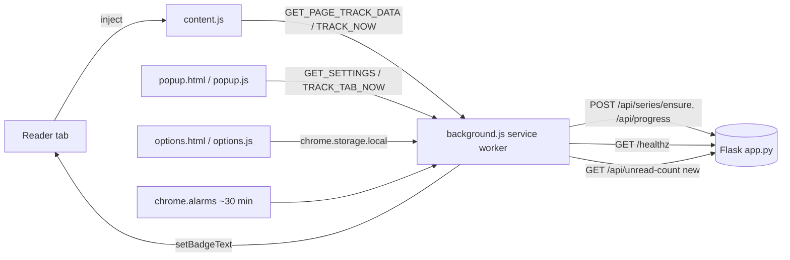

# Manga Tracker Companion — Extension Plan

This document is the canonical roadmap for the `extension/` Chrome (MV3) companion. It captures bug fixes, redesigns, new features, the small backend addition required, asset and permissions hygiene, store submission readiness, testing, and known limitations. It is grounded in the current code in [`extension/manifest.json`](extension/manifest.json), [`extension/content.js`](extension/content.js), [`extension/background.js`](extension/background.js), [`extension/popup.html`](extension/popup.html), [`extension/popup.js`](extension/popup.js), and [`app.py`](app.py).

## Architecture at a glance



---

## 1. Baseline vs this document (maintain parity)

Companion **v0.5.5** and `app.py` have moved ahead of older bullets archived below:

- SPA polling runs at **2.5s**, skips work when **`document.hidden`**, debounced **`MutationObserver`** covers content-swap navigations (`extension/content.js`).
- Track modal lives inside a **`ShadowRoot`** (`extension/content.js`).
- **`notifications`** is **not** in [`extension/manifest.json`](extension/manifest.json) anymore — remove from any remaining copy-paste checklist; desktop notifications remain a future optional feature (Section 4).
- **`GET /api/unread-count`** is implemented server-side (`app.py`), including **`tracked_url_norms`** for the extension badge.
- Duplicate rows in this section that are clearly fixed should be edited out periodically so the checklist stays actionable.

---

## ~~1~~ Archived — bugs to fix first (mostly resolved)

_Stale headings kept for grep; prefer Section 1 above._

## 2. Popup redesign

The popup should be a glanceable status surface, not a settings panel.

Three visual states:

1. **Not configured** — backend URL has never been saved or `/healthz` is unreachable. Show the configured URL, a "Open settings" link to `options.html`, and a one-line cause ("Backend offline" vs "URL not set").
2. **On a non-chapter page** — page does not look like a chapter. Show "No chapter detected on this page" and a secondary "Open dashboard" button.
3. **On a chapter page** — show detected **series title** and **chapter number/label**, plus the primary action.

Always include:

- A small **connection dot** that pings `${apiBase}/healthz` on popup open and renders green / amber / red. The endpoint already exists in [`app.py`](app.py) (`@app.route("/healthz")` around line 1423).
- Primary button copy that reflects state: **"Track now"** when not yet tracked, **"Already tracked"** (disabled or showing latest read chapter) when the series is known to the backend.

## 3. Settings / options page

Move every configuration knob out of the popup into a dedicated `options.html` (registered via `options_ui` with `open_in_tab: true`). The popup keeps only status and the primary action.

Settings to expose:

- **Backend URL** (existing `apiBase` in `chrome.storage.local`).
- **Auto-track toggle** — when on, recognized chapter pages are tracked silently with no modal (see Section 4).
- **Prompt cooldown** — how long the modal stays snoozed after "Not now" (current code hardcodes 24 hours in `content.js`). Expose this as minutes/hours.
- **Clear local data** — wipe `chrome.storage.local` (apiBase, debugEvents, etc.) and any `localStorage` snooze keys that are reachable from the extension origin.
- **Debug log** — render the last 25 entries from `chrome.storage.local.debugEvents` (already maintained by `storeDebug` in [`extension/background.js`](extension/background.js)) with timestamp, message type, and any error string. Provide a copy-to-clipboard button.

## 4. New features

- **Badge unread count.** Register a `chrome.alarms` job (~every 30 minutes plus an `onStartup` run) that calls `GET /api/unread-count` (Section 6) and writes the result via `chrome.action.setBadgeText`. Empty/zero clears the badge. Use a calm color (`setBadgeBackgroundColor`).
- **Desktop notifications (opt-in).** When the badge poll detects new unread chapters since the last poll, optionally fire a `chrome.notifications.create` summary ("3 new chapters across 2 series"). Off by default; toggle lives in `options.html`. This is what justifies keeping the `notifications` permission from Section 1.
- **Right-click context menu.** Add `chrome.contextMenus` entry "Track this manga chapter" on `page` and `link` contexts, scoped to the same hosts the content script runs on. It dispatches the same `TRACK_TAB_NOW` flow already implemented in [`extension/background.js`](extension/background.js).
- **Keyboard shortcut.** Declare a `commands` entry `track-current-chapter` with default `Alt+Shift+T` (Chrome auto-suggests `Ctrl+Shift+...` slots; `Alt+Shift+T` avoids most conflicts) that triggers `TRACK_TAB_NOW`.
- **Silent auto-track mode.** When the auto-track toggle is on, `maybeTrack()` in `content.js` should bypass the modal entirely and call the same `ENSURE_SERIES` + `SAVE_PROGRESS` pair that the existing `okBtn` path uses. Still write to the debug log so the user can see what was auto-tracked.

## 5. Site detection improvements

- **Expand `SUPPORTED_HOST_HINTS`.** The current list in `content.js` is a short substring match. Add the long-tail readers we actually see in the wild (e.g. `mangakakalot`, `mangapark`, `mangabuddy`, `kissmanga`, `mangaowl`, `flamescans`, `lhtranslation`, `cosmicscans`, etc.). Keep them as substrings to match locale TLDs and aggregator mirrors.
- **Per-site title extraction map.** Replace ad-hoc title guessing with a small registry: `{ hostMatcher, getSeriesTitle(document), getChapterLabel(document), getChapterNumber(document) }`. Fall through to the current generic heuristic when no host matches. This dramatically improves accuracy on the top 5–10 readers.
- **MangaDex via REST API.** MangaDex chapter pages are React-rendered and fragile to scrape. When the host is `mangadex.org` and the URL matches `/chapter/<uuid>`, fetch `https://api.mangadex.org/chapter/<uuid>?includes[]=manga` directly from the background service worker, then derive title and chapter number from the JSON. Skip DOM heuristics on that host entirely.
- **Image count as a negative signal.** Reader pages have many `` elements (the chapter pages); listing/landing pages typically do not. Use the count of large images (`naturalWidth > 600` or `` count > 8) as a positive vote, and flip it: when image count is **very low** on an otherwise chapter-looking URL, downweight detection to reduce false positives on series detail pages that happen to contain "chapter" in a recommendation list.

## 6. Backend changes

The extension uses session-based JSON routes: `/api/series/ensure`, `/api/progress`, `/healthz`, and **`GET /api/unread-count`** (with `tracked_url_norms`). The web app also exposes optional RSS (**`/feeds/rss/<token>`**) and Bearer-token **`GET /api/v1/bookmarks`** for tooling — not required by the MV3 companion.

Prefer reusing dashboard flows for any new writes; avoid adding parallel write endpoints unless there is a clear security boundary (CSRF/session vs bearer token vs admin token).

## 7. Icons

Ship all four required sizes as PNG, generated from a single SVG source:

- `icons/icon-16.png`, `icons/icon-32.png`, `icons/icon-48.png`, `icons/icon-128.png`.

Visual: the same indigo gradient used by the web app favicon, with a simple bookmark or chapter glyph centered. Keep stroke widths legible at 16 px (no thin 1 px details). Reference these in `manifest.json` under both top-level `icons` and `action.default_icon`.

## 8. Target file structure

```
extension/
  manifest.json
  background.js
  content.js
  popup.html
  popup.js
  options.html        new
  options.js          new
  icons/              new
    icon-16.png
    icon-32.png
    icon-48.png
    icon-128.png
```

`manifest.json` updates required:

- `icons` (top level, all 4 sizes).
- `action.default_icon` (same 4 sizes).
- `options_ui`: `{ "page": "options.html", "open_in_tab": true }`.
- `commands.track-current-chapter` with `Alt+Shift+T`.
- `permissions` additions: `alarms`, `contextMenus` (and keep `notifications` only if Section 4 is shipped).

## 9. Final permissions list

Each permission with its single-line justification:

- `storage` — persist `apiBase`, `debugEvents`, options toggles.
- `activeTab` — read the current tab's URL/title for popup detection and the `TRACK_TAB_NOW` flow.
- `tabs` — query the active tab from the popup and message its content script.
- `alarms` — schedule the ~30 min `unread-count` badge poll.
- `contextMenus` — register the "Track this manga chapter" right-click action.
- `notifications` — opt-in desktop notifications when new unread chapters are detected. Remove this entry if the feature is not shipped.
- `host_permissions: <all_urls>` — manga and manhwa readers live on hundreds of independent domains and mirrors; we cannot enumerate them. The content script only acts on pages whose URL or DOM matches the chapter heuristics, and the only network calls it makes go to the user's own configured backend (`apiBase`). This rationale is what we will put in the Chrome Web Store justification field.

## 10. Chrome Web Store submission checklist

- Privacy policy hosted at a stable URL (cover: data collected = none beyond what the user's self-hosted backend already stores; data shared = none; permissions justification mirrors Section 9).
- All four icon sizes from Section 7.
- 1280×800 or 640×400 screenshots: popup on a chapter page, popup with backend offline, options page, modal prompt on a real reader.
- 128×128 store icon, small promotional tile (440×280) optional but recommended.
- Listing copy: short description (≤132 chars), detailed description, single-purpose statement ("Detects manga/manhwa chapter pages and syncs reading progress to the user's self-hosted Manga Tracker backend").
- Single Purpose declaration matches the description.
- Permissions justifications filled in for every permission and `<all_urls>`.
- Demo account or self-hosted instance URL for the review team, plus a 30-second screencast.
- Versioned ZIP that excludes any source maps, `.DS_Store`, and editor cruft.

## 11. Testing checklist

Content script:

- Loads on direct chapter URL and on SPA navigation between chapters (URL change and DOM-only swap).
- Detects chapter number from URL, title, and breadcrumb formats.
- Modal renders correctly inside Shadow DOM on sites with aggressive CSS resets (test on at least: AsuraScans, MangaDex, Bato.to, Webtoons).
- Snooze persists across reloads and is keyed by `seriesKey`.

Background service worker:

- Survives MV3 idle/wake cycles; alarms continue to fire after the worker is unloaded.
- `TRACK_TAB_NOW`, `ENSURE_SERIES`, `SAVE_PROGRESS` all forward the session cookie (`credentials: "include"`) and surface 401s with the "Not signed in" hint already present in [`extension/background.js`](extension/background.js).
- Badge updates correctly on alarm fire, on `onStartup`, and after a manual track.

Popup:

- All three states render with no network (offline backend), with an unrecognized page, and with a chapter page.
- `/healthz` connection dot reflects real status within 1s.

Options page:

- Saves and restores backend URL, auto-track, and cooldown.
- "Clear local data" wipes `chrome.storage.local` and reflects the change in the popup immediately.
- Debug log paginates / scrolls and copy-to-clipboard works.

Smoke regression on each release:

- Sign in to dashboard → open a known chapter page → expect either the modal or a silent track depending on auto-track toggle → confirm row appears in dashboard.

## 12. Known limitations to document

- **Self-hosted backend required.** The extension is useless without a running Manga Tracker instance reachable from the user's machine. This must be on the store listing.
- **Session-cookie auth.** The extension relies on the user being signed in to the dashboard in the same browser profile; we forward the cookie via `credentials: "include"`. There is no token flow yet, so cross-browser or incognito profiles will not authenticate.
- **`<all_urls>` host access.** Required for arbitrary reader sites. Documented in Section 9.
- **Heuristic chapter detection.** Title/URL/DOM heuristics will produce false positives and misses on unusual readers. The per-site map (Section 5) reduces but does not eliminate this.
- **MV3 service worker lifecycle.** The background script is unloaded after ~30 s idle. All long-running state must live in `chrome.storage` or be reconstructed from `chrome.alarms`/event listeners; do not rely on module-scope variables persisting between events.

## 13. Deferred platform work (main app / ops)

These items belong to the Flask backend and deployment story, not the companion UI itself:

- Split the monolithic `app.py` into blueprints or modules (routes, database, scraping, scheduler, admin).
- Implement or remove the `POST /api/import/mal` stub once MyAnimeList API access and UX are defined.
- Add Origin / Referer allowlists for CSRF-exempt JSON routes that mutate account or API-token state (defense in depth on top of session auth).
- Optional: move Selenium to an extra requirements file when `USE_SELENIUM_FALLBACK=0` is the long-term default.
- Decide a single public marketing entry point (Flask `landing.html` vs the Next `landing/` site) or document both URLs clearly.
